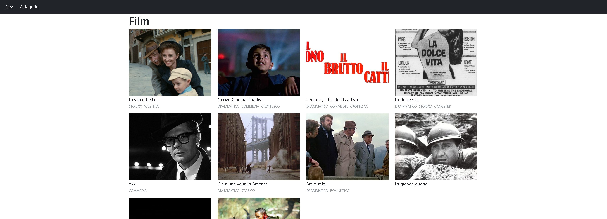
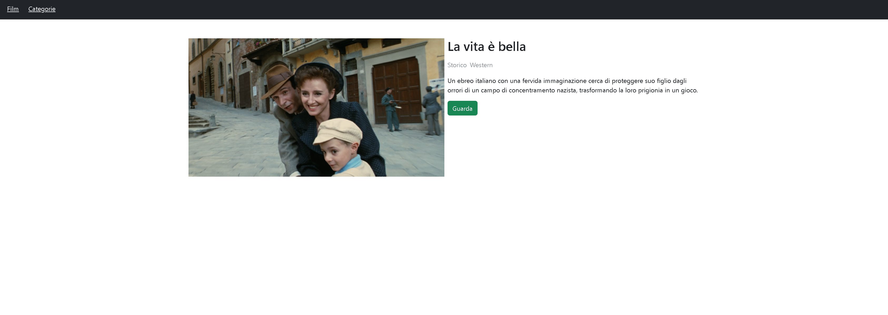
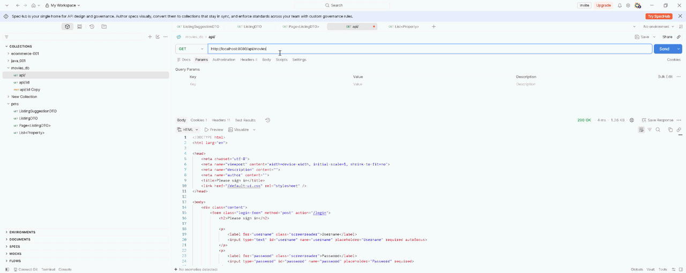
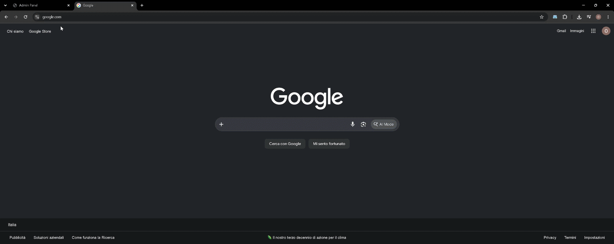

# 🎬 Cinema — Frontend

The React frontend of a full-stack cinema management application.

The application communicates with the **Cinema Spring Boot backend** through REST APIs. The frontend retrieves cinema data dynamically from the backend rather than relying on hardcoded information.

The backend also includes a **Thymeleaf-based backoffice** used to manage the same data stored in the MySQL database.

## 🛠️ Tech Stack

- **React**
- **Vite**
- **JavaScript**
- **CSS**
- **REST API**

## 🏗️ Architecture

```text
┌──────────────────────┐
│    React Frontend    │
│                      │
│   Components / UI    │
└──────────┬───────────┘
           │
           │ HTTP / REST API
           ▼
┌──────────────────────┐
│   Spring Boot API    │
│                      │
│ Controllers          │
│ Services             │
│ DTOs                 │
└──────────┬───────────┘
           │
           ▼
      ┌──────────┐
      │  MySQL   │
      └──────────┘
```

The Spring Boot backend also contains a separate **Thymeleaf backoffice** for administration.

```text
                  ┌───────────────┐
                  │     MySQL     │
                  └───────┬───────┘
                          │
                    Spring Boot
                     /         \
                    /           \
                   ▼             ▼
          REST API           Thymeleaf
              │              Backoffice
              ▼
       React Frontend
```

## ✨ Features

- Dynamic movie catalogue
- Movie details
- REST API integration
- Dynamic data rendering
- Responsive interface
- Reusable React components
- Loading and error states
- Backend-driven data
- Separation between frontend and backend

## 🔄 Dynamic Backend Integration

The frontend does not contain a static copy of the cinema catalogue.

Instead, it requests the current data from the Spring Boot API:

```text
MySQL
  ↓
Spring Boot
  ↓
REST API
  ↓
React
  ↓
Rendered UI
```

This means that when data is changed on the backend, the frontend can retrieve the updated information and reflect those changes in the interface.

For example:

```text
Add / edit / remove movie
          ↓
      Spring Boot
          ↓
        MySQL
          ↓
      REST API
          ↓
    React Frontend
          ↓
     Updated UI
```

## 📸 Screenshots

### 🎞️ Movie Catalogue



### 🎬 Movie Details



### 🔄 Backend-Driven Data



### 🎥 Live Backend Data Synchronization

The following recording demonstrates the complete data flow in action:



The complete flow is:

```text
Thymeleaf Backoffice
        ↓
   Spring Boot
        ↓
      MySQL
        ↓
    REST API
        ↓
  React Frontend
        ↓
   Updated UI
```

This demonstrates that the React frontend is not using hardcoded cinema data, but is dynamically consuming the backend API.

## 🔗 Backend

The React application works together with the Spring Boot backend:

**Cinema Backend:** https://github.com/olegbucolo/cinema

The backend provides both the REST API consumed by this application and a Thymeleaf-based backoffice for administration.

## 🚀 Getting Started

Clone the repository:

```bash
git clone https://github.com/olegbucolo/cinema-frontend.git
cd cinema-frontend
```

Install dependencies:

```bash
npm install
```

Start the development server:

```bash
npm run dev
```

Make sure the Cinema backend is running and that the frontend is configured with the correct API URL.